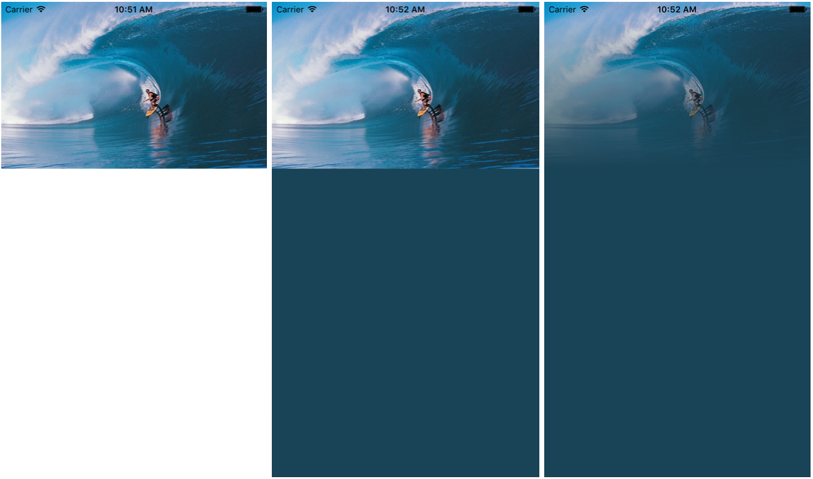

# FTMainColor
FTMainColor is a usefull Pod written in Swift to get the main color from an UIImage. Build awesome dynamic view from an image. Here is a step by step example :



1. You just got your ```UIImageView``` with an image.
2. Find the main color using the Pod and set your view's ```backgroundColor```
3. Add a gradient layer on your picture to smoothly integrate your image
4. And whatever you want juste like a label

## Install

### Pod

Go to your project directory and type ```pod init```
Add theses lines to your Podfile :

```
use_frameworks!

pod 'FTMainColor', :git => 'https://github.com/fthomasmorel/FTMainColor.git'
```

Run a ```pod install``` and get the job done. You can now open the ```.xcworkspace``` project.

## Usage

### Import
Before using the pod, don't forget to import ```FTMainColor``` :

```swift
import FTMainColor
```

**NB : It's possible that XCode 7 find an error on the import. Try to clean and build. It works for me**

### Get the main color

Simply use the function ```getMainColor``` as follow :

```swift
let color:FTColor = getMainColor(your_uiimage)
```

Now you get a ```FTColor``` object. If you want to get the ```UIColor``` from the ```FTColor```, just use ```getUIColor()```.

### Get a gradient layer with the new color

This is an example of what you can do with this Pod. Once you got the main color from your picture, you can set the backgroundColor for your view to the new color and add a gradient layer on the UIImage to get the image smoothly integrate in your view.

```swift
let color:FTColor = getMainColor(imageView.image!, withIndice: 1500)
let opaqueColor = color.getUIColor()
let transColor = UIColor(red: color.red, green: color.green, blue: color.blue, alpha: 0)
        
let gradient: CAGradientLayer = CAGradientLayer()
        
gradient.colors = [opaqueColor.CGColor, transColor.CGColor]
gradient.locations = [0 , 1]
gradient.startPoint = CGPoint(x: 0.0, y: 1.0)
gradient.endPoint = CGPoint(x: 0.0, y: 0.1)
gradient.frame = CGRect(x: 0.0, y: 0.0, width: imageView.frame.size.width, height: imageView.frame.size.height)
        
imageView.layer.insertSublayer(gradient, atIndex: 0)
self.view.backgroundColor = opaqueColor
```

## FTMainColor

I know the algorithm is not perfect, i will try to improve as soon as possible. If you have some ideas, questions or comments, do not hesitate :) Thank you.